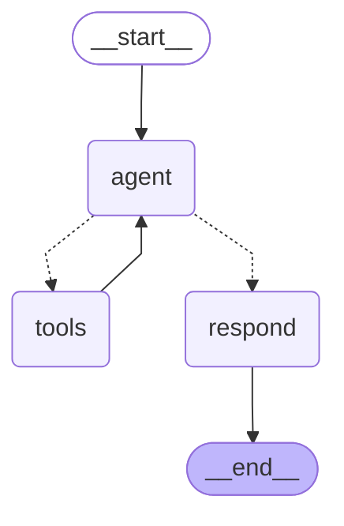
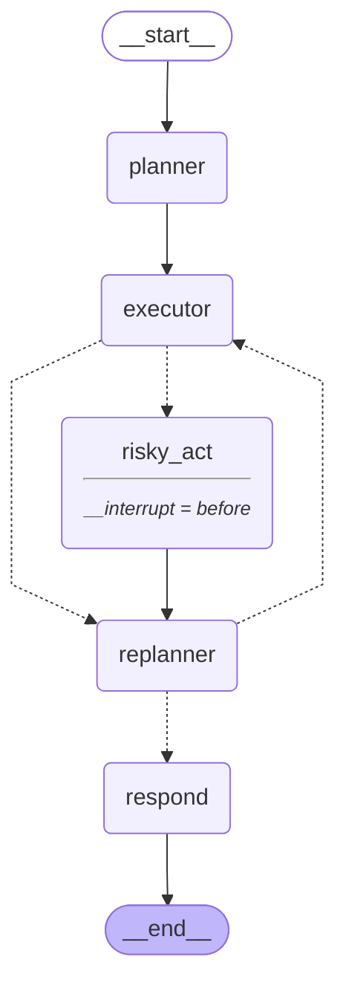

# Графи агентів

## ReAct

```mermaid
---
config:
  flowchart:
    curve: linear
---
graph TD;
	__start__([<p>__start__</p>]):::first
	agent(agent)
	tools(tools)
	respond(respond)
	__end__([<p>__end__</p>]):::last
	__start__ --> agent;
	agent -.-> respond;
	agent -.-> tools;
	tools --> agent;
	respond --> __end__;
	classDef default fill:#f2f0ff,line-height:1.2
	classDef first fill-opacity:0
	classDef last fill:#bfb6fc
```

## Plan-and-Execute

```mermaid
---
config:
  flowchart:
    curve: linear
---
graph TD;
	__start__([<p>__start__</p>]):::first
	planner(planner)
	executor(executor)
	risky_act(risky_act<hr/><small><em>__interrupt = before</em></small>)
	replanner(replanner)
	respond(respond)
	__end__([<p>__end__</p>]):::last
	__start__ --> planner;
	executor -.-> replanner;
	executor -.-> risky_act;
	planner --> executor;
	replanner -.-> executor;
	replanner -.-> respond;
	risky_act --> replanner;
	respond --> __end__;
	classDef default fill:#f2f0ff,line-height:1.2
	classDef first fill-opacity:0
	classDef last fill:#bfb6fc
```
